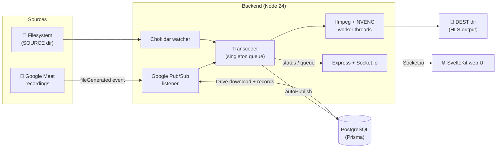
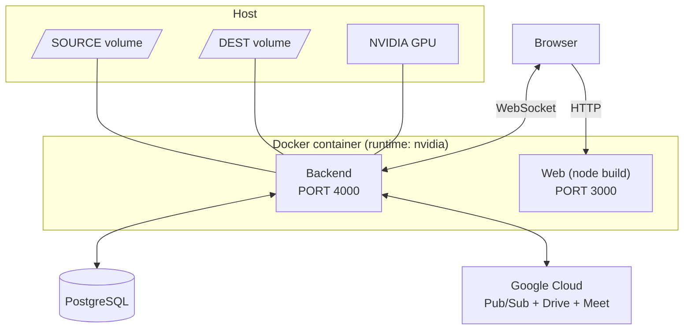
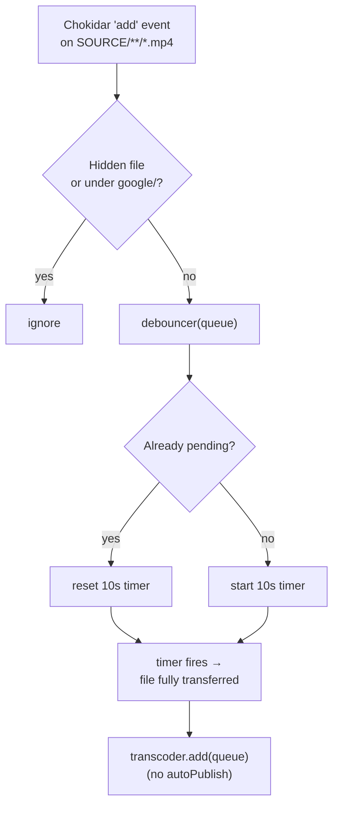
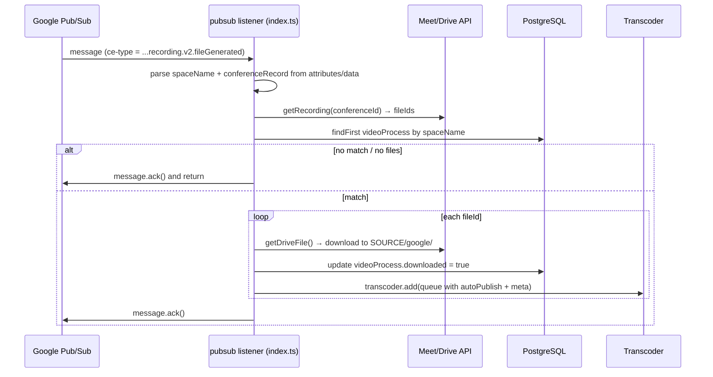
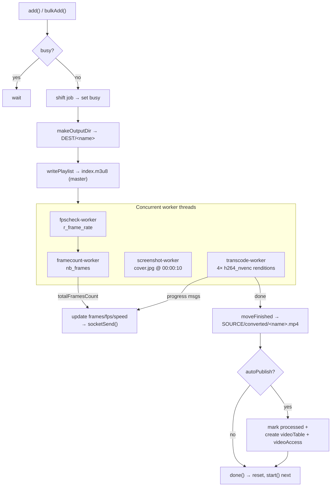
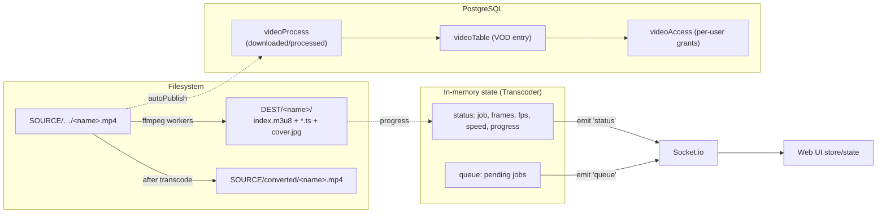
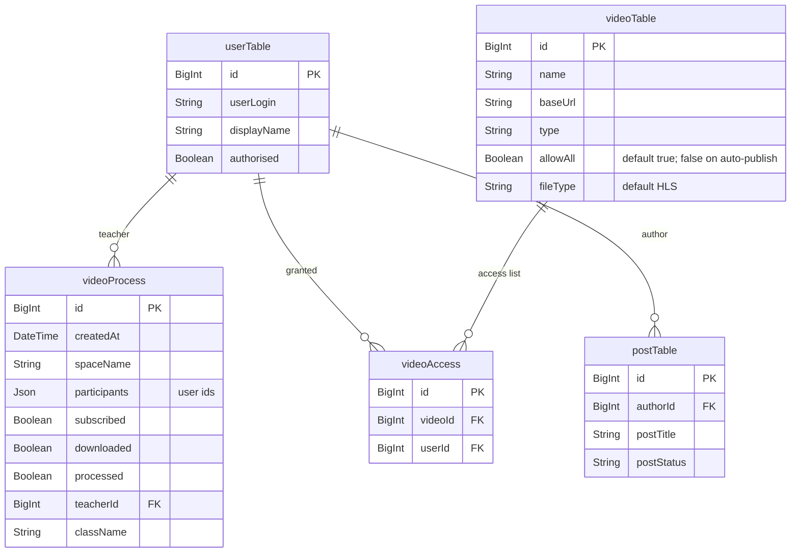

# Architecture & Design

This document describes the system design, runtime architecture, end-to-end
workflows, and data flow of **auto-convert-to-hls**. All diagrams use
[Mermaid](https://mermaid.js.org/) and render natively on GitHub.

For setup, commands, and environment variables see the [README](../README.md).
For repository conventions see [CLAUDE.md](../CLAUDE.md).

---

## 1. Overview

The system turns MP4 recordings into multi-rendition **HLS** (HTTP Live
Streaming) assets for video-on-demand. Two independent ingestion sources feed a
single, in-memory **sequential transcoding queue**. A SvelteKit web UI shows
live progress over Socket.io.



### Components

| Component | Path | Responsibility |
|---|---|---|
| Filesystem watcher | `backend/src/watcher/watcher.ts` | Detect new `.mp4` files in `SOURCE` |
| Pub/Sub listener | `backend/src/watcher/pubsub.ts` | Receive Meet events, download from Drive |
| Orchestrator | `backend/src/index.ts` | Wire sources → queue, debounce, replay unfinished |
| Transcoder | `backend/src/ffmpeg/ffmpeg.ts` | Singleton job queue, spawn workers, publish |
| Workers | `backend/src/ffmpeg/*-worker.ts` | fpscheck / framecount / screenshot / transcode |
| API | `backend/src/api/express.ts` | REST `/status` & `/queue`, Socket.io broadcasts |
| Web UI | `web/src/routes/+page.svelte` | Live status & queue display |
| Persistence | `backend/prisma/schema.prisma` | `videoProcess`, `videoTable`, `videoAccess`, `userTable`, `postTable` |

---

## 2. Runtime / Deployment Topology

A single container (NVIDIA runtime) runs both the backend and the built web
server. Host directories are bind-mounted for source and destination media.



- **Backend** (`PORT`, default `4000`) — REST + Socket.io, owns the GPU and file I/O.
- **Web** (`3000`) — serves the SvelteKit UI; the browser connects to the backend's Socket.io directly via `PUBLIC_SOCKET_URL`.
- External dependencies: PostgreSQL (Prisma), and Google Cloud (Pub/Sub subscription, Drive download, Meet conference lookups).

---

## 3. Ingestion Workflows

Both paths converge on `transcoder.add(queue)`. The key difference: filesystem
jobs carry no `meta` and **do not publish**; Pub/Sub jobs set `autoPublish` and
carry `meta` (`id`, `participants`, `className`) so they create VOD + access
records on completion.

### 3.1 Filesystem watcher



On startup, `watcher` also emits `ready`; `getAllFiles(SOURCE)` collects
pre-existing files and `transcoder.bulkAdd()` enqueues them. The 10-second
debounce (`index.ts`) prevents transcoding a file that is still being copied.

### 3.2 Google Meet via Pub/Sub



**Startup replay** — `getAllUnfinished()` queries `videoProcess` for records
that are not yet `processed` (downloaded or not), re-resolves their conferences
and recordings via `getConferences`/`getRecording`, downloads, and enqueues
them. This makes ingestion resilient to restarts and missed messages.

---

## 4. Transcoding Pipeline

The `Transcoder` is a **singleton with an internal array queue** and a `busy`
flag, so exactly one job runs at a time. `add()` dedupes by `name` against both
the pending queue and the in-flight job.



### Workers (`backend/src/ffmpeg/`)

| Worker | Tool | Purpose |
|---|---|---|
| `fpscheck-worker.ts` | `ffprobe` (`r_frame_rate`) | Source FPS, feeds frame-count normalization |
| `framecount-worker.ts` | `ffprobe` (`nb_frames`) | Total frames → progress denominator (scaled to `DefaultFPS` 30) |
| `screenshot-worker.ts` | `ffmpeg -ss 00:00:10` | Cover image `cover.jpg` |
| `transcode-worker.ts` | `ffmpeg` (cuvid → NVENC) | The four HLS renditions |

`totalFramesCount = nb_frames * DefaultFPS / sourceFPS`. The transcoder also
guards against underestimates: if reported `frames` exceed the estimate,
`totalFramesCount` is bumped to keep progress ≤ 100%.

### Renditions (`default-renditions.ts`)

Decode once with `-hwaccel cuvid -c:v h264_cuvid`; scale on GPU with
`scale_npp`; encode each rendition with `h264_nvenc` (preset `medium`),
AAC audio, 4-second HLS segments (`vod` playlist type).

| Rendition | Scale | Video (`-b:v` / maxrate / bufsize) | Audio |
|---|---|---|---|
| 360p | `-1:360` | 800k / 856k / 1200k | 96k |
| 480p | `-1:480` | 1400k / 1498k / 2100k | 128k |
| 720p | `-1:720` | 2800k / 2996k / 4200k | 128k |
| 1080p | `-1:1080` | 5000k / 5350k / 7500k | 192k |

**Output layout** under `DEST/<name>/`: `index.m3u8` (master), per-rendition
`<height>.m3u8` + `<label>_NNN.ts` segments, and `cover.jpg`.

---

## 5. Data Flow

How a single recording's data moves across filesystem, database, and clients.



- **State broadcast:** every transcoder mutation calls `socketSend()`, which
  emits `status` and `queue`. New clients receive a snapshot on `connection`.
- **REST mirrors state:** `GET /status` and `GET /queue` return the same
  objects for polling/health checks.
- **Auto-publish writes:** on a Pub/Sub job's completion, `videoProcess.processed`
  is set `true`, a `videoTable` row is created (`type='vod'`, `allowAll=false`,
  `baseUrl=${VOD_BASE_URL}/<name>`), and one `videoAccess` row per participant
  user id is created from `meta.participants`.

---

## 6. Data Model



- `videoProcess` is the ingestion ledger for Meet recordings; `downloaded` /
  `processed` drive the startup replay.
- `videoTable` + `videoAccess` model published VOD entries and per-user access.
  `videoAccess` uses **row-level security** (see the schema note and
  <https://pris.ly/d/row-level-security>).
- `userTable` / `postTable` are shared with a broader platform; this service
  only writes `videoProcess`, `videoTable`, and `videoAccess`.

---

## 7. API & Real-time Contract

| Channel | Name | Payload |
|---|---|---|
| REST `GET /status` | — | `{ busy, job, currentFrames, totalFramesCount, fps, speed, progress }` |
| REST `GET /queue` | — | `{ length, queue: Queue[] }` |
| Socket.io emit | `status` | same as `/status` |
| Socket.io emit | `queue` | same as `/queue` |

- CORS origin(s) come from `CORSHOST` (single value or comma-separated list,
  parsed by `parseCorsOrigins`).
- The web client connects with **WebSocket transport only**
  (`transports: ['websocket']`) to avoid XHR long-polling issues behind reverse
  proxies, and tears the socket down in `onDestroy`.

---

## 8. Design Notes & Constraints

- **Single sequential queue** — GPU encode is the bottleneck; one job at a time
  keeps NVENC saturated without contention. Dedup by `name` prevents double
  enqueue from overlapping watcher/replay events.
- **In-memory queue** — pending jobs are *not* persisted. A crash loses the
  pending list, but Pub/Sub jobs are recoverable via `getAllUnfinished()` and
  filesystem jobs via the `ready` rescan. Plain filesystem drops mid-queue are
  re-detected only if the file is still in `SOURCE`.
- **Progress is an estimate** — derived from `ffprobe` frame counts normalized
  to 30 fps, then corrected upward if ffmpeg reports more frames.
- **Hardware dependency** — requires an NVIDIA GPU and an ffmpeg build with
  `h264_cuvid` / `h264_nvenc` / `scale_npp`. Tests mock all of this.
```

